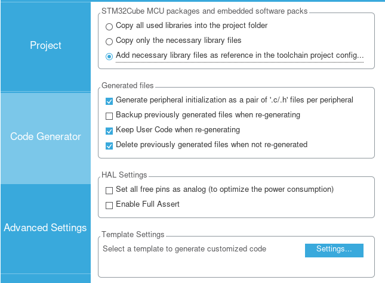
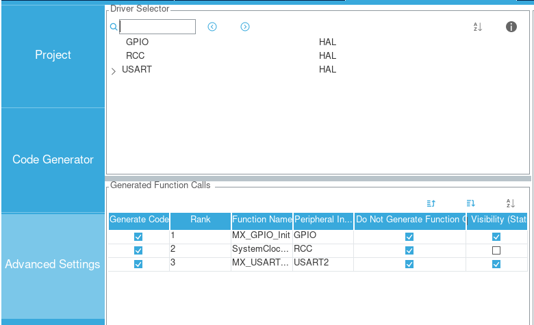
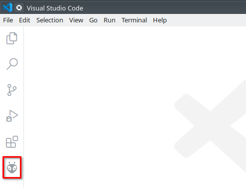
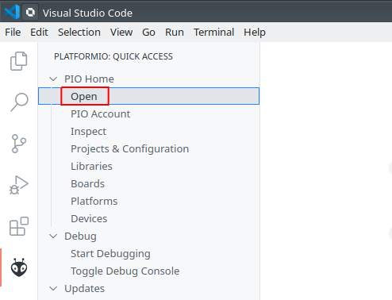
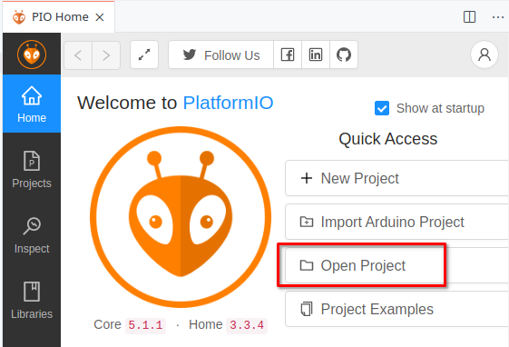
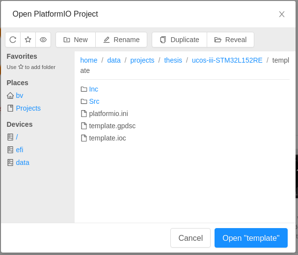
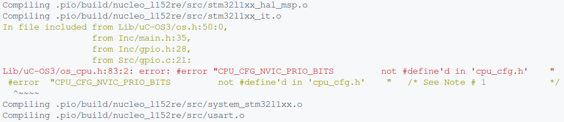
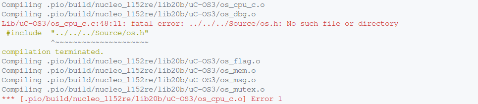

# ucos-iii-STM32L152RE

## Table of Contents

<!-- vim-markdown-toc GFM -->

- [Hardware](#hardware)
- [Toolchain](#toolchain)
	- [On Arch Linux](#on-arch-linux)
	- [On Windows 10](#on-windows-10) 	 
- [Generate a STM32 project with STM32CubeMX](#generate-a-stm32-project-with-stm32cubemx)
- [Import the project to Platformio](#import-the-project-to-platformio)
- [Porting ucos-iii](#porting-ucos-iii)
- [References](#references)

<!-- vim-markdown-toc -->

## Hardware
- [STM32 Nucleo-L152RE](https://www.st.com/en/evaluation-tools/nucleo-l152re.html)

## Toolchain 
### On Arch Linux
- [STM32CubeMX](https://aur.archlinux.org/packages/stm32cubemx/)
- [python](https://archlinux.org/packages/extra/x86_64/python/)
- [platformio](https://docs.platformio.org/en/latest/core/installation.html)

---
>**NOTE:** 
>- Install [pip](https://archlinux.org/packages/extra/any/python-pip/) if you use `Python Package Manager` to install `platformio`. 
>- Use `sudo` to install `platformio` globally. If `platformio` is installed locally then the script location should be added to `PATH` variable.

---
- [stlink](https://archlinux.org/packages/community/x86_64/stlink/)
    - Add [99-platformio-udev.rules](https://raw.githubusercontent.com/platformio/platformio-core/master/scripts/99-platformio-udev.rules) under `/usr/lib/udev/rules.d/` directory for PlatformIO supported boards/devices. 
    ---
    >**NOTE:**
    >- `rules.d` directory might be located in differ path depending which Linux distribution you are using.

    ---
    - Restart `udev`
    ```bash
    sudo udevadm control --reload-rules
    sudo udevadm trigger
    ```
    - Plug `STM32 Nucleo L152RE` in and find info of the device. For example: 
    ```bash
    stat /dev/ttyACM0 
    ```
    ```bash
      File: /dev/ttyACM0
      Size: 0               Blocks: 0          IO Block: 4096   character special file
    Device: 5h/5d   Inode: 870         Links: 1     Device type: a6,0
    Access: (0666/crw-rw-rw-)  Uid: (    0/    root)   Gid: (  987/    uucp)
    Access: 2021-04-07 15:01:25.817096629 +0300
    Modify: 2021-04-07 15:01:25.817096629 +0300
    Change: 2021-04-07 15:01:25.817096629 +0300
     Birth: -
    ```
    - As in the above output, the device belongs to `uucp` group so you need to add you to `uucp` group
    ```bash
    sudo usermod -a -G uucp $USER
    ```
    ---
    >**NOTE:**
    >- Log out and log in again or restart for the changes to take effect.
    >- Run `groups` command to check if the user is add to `uucp` group
    ---
- [visual-studio-code](https://aur.archlinux.org/packages/visual-studio-code-bin/) and [PlatformIO IDE](https://marketplace.visualstudio.com/items?itemName=platformio.platformio-ide) plug-in.

### On Windows 10
- Download and install the following programs
	- [STM32CubeMX](https://www.st.com/en/development-tools/stm32cubemx.html)
	- [Visual Studio Code](https://code.visualstudio.com/Download)
	- [stlink](https://www.st.com/en/development-tools/stsw-link009.html) 
	- [STM32 Virtual COM Port Driver](https://www.st.com/en/development-tools/stsw-stm32102.html): Starting from Windows® 10, the STSW-STM32102 driver is no more adequate and the usage of the native inbox driver is recommended.
- Search and install PlatformIO plugin in Extension tab of Visual Studio Code 
 
## Generate a STM32 project with STM32CubeMX
- `STM32CubeMX` > `File` > `New Project` > `Board Selector` > `Commercial Part Number` = `NUCLEO-L152RE` > Select the board > `Start Project`
- Use following settings for the project:
	- `Application Structure`: `Basic` and `Do not generate the main() function`
	- `Toolchain/IDE`: `Other Toolchains`
	- `Add necessary library files as reference in the toolchain project config`
	- `Generate peripheral initialization as a pair of '.c/.h' files per peripheral`
	- `Do Not Generate Function Call` for all functions.
  





- Then `Generate Code`. The generated project will have following files:
```bash
├── Inc
│   ├── gpio.h
│   ├── main.h
│   ├── stm32l1xx_hal_conf.h
│   ├── stm32l1xx_it.h
│   └── usart.h
├── Src
│   ├── gpio.c
│   ├── main.c
│   ├── stm32l1xx_hal_msp.c
│   ├── stm32l1xx_it.c
│   ├── system_stm32l1xx.c
│   └── usart.c
├── template.gpdsc
└── template.ioc
2 directories, 13 files
```
## Import the project to Platformio
- In the generated project directory, create a file named `platformio.ini` with following content:
```ini
[env:nucleo_l152re]
platform = ststm32
board = nucleo_l152re
framework = stm32cube
lib_ldf_mode = chain+
debug_tool = stlink
upload_protocol = stlink
build_flags = -Wl,-Map,./.pio/build/link.map

[platformio]
include_dir = Inc
src_dir = Src
lib_dir = Lib
```
- In VSCode, click  icon on the `Activity Bar` > `Open` >`Open Project` > Locate the generated project









- After imported, serveral files and directories will be automatically generated.
```bash
├── .gitignore  
├── Inc  
│   ├── gpio.h  
│   ├── main.h  
│   ├── stm32l1xx_hal_conf.h  
│   ├── stm32l1xx_it.h  
│   └── usart.h  
├── .mxproject  
├── .pio  
│   └── build  
│       ├── nucleo_l152re  
│       └── project.checksum  
├── platformio.ini  
├── Src  
│   ├── gpio.c  
│   ├── main.c  
│   ├── stm32l1xx_hal_msp.c  
│   ├── stm32l1xx_it.c  
│   ├── system_stm32l1xx.c  
│   └── usart.c  
├── template.gpdsc  
├── template.ioc  
└── .vscode  
   ├── c_cpp_properties.json  
   ├── extensions.json  
   └── launch.json  
  
6 directories, 20 files
```

## Porting ucos-iii
- In the generated project, create a directory named `Lib` to store libraries.
- Download or clone following repositories:
	- (1) [https://github.com/weston-embedded/uC-OS3/](https://github.com/weston-embedded/uC-OS3/)
	- (2) [https://github.com/weston-embedded/uC-CPU/](https://github.com/weston-embedded/uC-CPU/)
	- (3) [https://github.com/weston-embedded/uC-LIB/](https://github.com/weston-embedded/uC-LIB/)
- Copy files from downloaded/cloned repositories to `Lib` directory as following:

---
> NOTE:
> - `cfg` directory contains config files from `Cfg/Template` of downloaded/cloned repositories
> - `STM32 Nucleo L152RE` board and `gcc` compiler are used in this project so
>     - `uc-LIB`: copy files under `Ports/ARM-Cortex-M3/GNU` directory
>     - `uc-CPU`: copy files under  `ARM-Cortex-M/ARMv7-M/GNU` directory


---
```
Lib
├── cfg
│   ├── cpu_cfg.h               (2)/Cfg/Template/
│   ├── lib_cfg.h               (3)/Cfg/Template/
│   ├── os_app_hooks.c          (1)/Cfg/Template/
│   ├── os_app_hooks.h          (1)/Cfg/Template/
│   ├── os_cfg_app.h            (1)/Cfg/Template/
│   └── os_cfg.h                (1)/Cfg/Template/
├── uC-CPU
│   ├── cpu_a.s                 (2)/ARM-Cortex-M/ARMv7-M/GNU/
│   ├── cpu_cache.h             (2)/
│   ├── cpu_c.c                 (2)/ARM-Cortex-M/ARMv7-M/
│   ├── cpu_core.c              (2)/
│   ├── cpu_core.h              (2)/
│   ├── cpu_def.h               (2)/
│   └── cpu.h                   (2)/ARM-Cortex-M/ARMv7-M/GNU/
├── uC-LIB
│   ├── lib_ascii.c             (3)/
│   ├── lib_ascii.h             (3)/ 
│   ├── lib_def.h               (3)/ 
│   ├── lib_math.c              (3)/ 
│   ├── lib_math.h              (3)/ 
│   ├── lib_mem_a.s             (3)/Ports/ARM-Cortex-M3/GNU/
│   ├── lib_mem.c               (3)/ 
│   ├── lib_mem.h               (3)/ 
│   ├── lib_str.c               (3)/ 
│   └── lib_str.h               (3)/ 
└── uC-OS3
    ├── __dbg_uCOS-III.c        (1)/Source/
    ├── os_cfg_app.c            (1)/Source/
    ├── os_core.c               (1)/Source/
    ├── os_cpu_a.S              (1)/Ports/ARM-Cortex-M/ARMv7-M/GNU/
    ├── os_cpu_c.c              (1)/Ports/ARM-Cortex-M/ARMv7-M/
    ├── os_cpu.h                (1)/Ports/ARM-Cortex-M/ARMv7-M/GNU/
    ├── os_dbg.c                (1)/Source/
    ├── os_flag.c               (1)/Source/
    ├── os.h                    (1)/Source/
    ├── os_mem.c                (1)/Source/
    ├── os_msg.c                (1)/Source/
    ├── os_mutex.c              (1)/Source/
    ├── os_prio.c               (1)/Source/
    ├── os_q.c                  (1)/Source/
    ├── os_sem.c                (1)/Source/
    ├── os_stat.c               (1)/Source/
    ├── os_task.c               (1)/Source/
    ├── os_tick.c               (1)/Source/
    ├── os_time.c               (1)/Source/
    ├── os_tmr.c                (1)/Source/
    ├── os_trace.h              (1)/Source/
    ├── os_type.h               (1)/Source/
    └── os_var.c                (1)/Source/

4 directories, 46 files
```
- Enable `CPU_CFG_NVIC_PRIO_BITS` in `cpu_cfg.h` file to fix following error:



- Change `#include  "../../../Source/os.h"`  in `os_cpu_c.c` file to `#include "os.h"` to fix following error:



- Find the startup file for `STM32 Nucleo L152RE` (version for `gcc` - GNU toolchain) and copy it to `Src` directory of the project. Under GNU/Linux, you can use `find` or `locate` command (requires `mlocate` installed) to find the file under `~/platformio` directory.
  ```bash
  find ~/.platformio -name startup_stm32l152xe.S
  ```
  or
  ```bash
  sudo updatedb
  locate startup_stm32l152xe.S
  ```

---
> OS_CPU_SysTickHandler() is automatically invoked by the Cortex-M3 when a SysTick interrupt occurs and interrupts are enabled. For this to happen, however, the address of **OS_CPU_SysTickHandler() must be placed in the interrupt vector table at the SysTick entry**
>
> --- <cite>[µC/OS-III for the STMicroelectronics STM32][1]</cite>

>Note that you **must place a pointer to OS_CPU_PendSVHandler() in the exception vector table** at vector location 14 (based of the vector table + 4 * 14 or, offset 56).
>
> --- <cite>[Application Note AN-1018: µC/OS-II and ARM Cortex-M3 Processors][2]</cite>

---
- As above mentionted quotes, `PendSV` and `SysTick` entries in the interrupt vector table must be replaced with `OS_CPU_PendSVHandler` and ` OS_CPU_SysTickHandler`. To do that the vector table in `startup_stm32l152xe.S` should be modified as follow:
  ```
    .syntax unified
    .cpu cortex-m3
    .fpu softvfp
    .thumb

  .extern OS_CPU_PendSVHandler
  .extern OS_CPU_SysTickHandler

  .global g_pfnVectors
  .global Default_Handler
  ```

  ```
  g_pfnVectors:
    .word _estack
    .word Reset_Handler
    .word NMI_Handler
    .word HardFault_Handler
    .word MemManage_Handler
    .word BusFault_Handler
    .word UsageFault_Handler
    .word 0
    .word 0
    .word 0
    .word 0
    .word SVC_Handler
    .word DebugMon_Handler
    .word 0
    .word OS_CPU_PendSVHandler
    .word OS_CPU_SysTickHandler
  ```
- Include `os.h` in `main.h`
- Create `main()` function in `main.c`

## References
- [µC/OS-III for the STMicroelectronics STM32][1]
- [Application Note AN-1018: µC/OS-II and ARM Cortex-M3 Processors][2]
- [Reference Manual RM0038 - STM32L100xx, STM32L151xx, STM32L152xx and STM32L162xx][3]

[1]: https://micrium.atlassian.net/wiki/spaces/osiiidoc/overview?homepageId=132386&preview=/132386/157512/100-uCOS-III-ST-STM32-003.pdf
[2]: https://www.element14.com/community/servlet/JiveServlet/previewBody/35592-102-2-216909/OSs-Micrium-Learning%20Centre-Application%20Notes-Micrium.Application_Notes_22.pdf
[3]: https://www.st.com/content/ccc/resource/technical/document/reference_manual/cc/f9/93/b2/f0/82/42/57/CD00240193.pdf/files/CD00240193.pdf/jcr:content/translations/en.CD00240193.pdf
